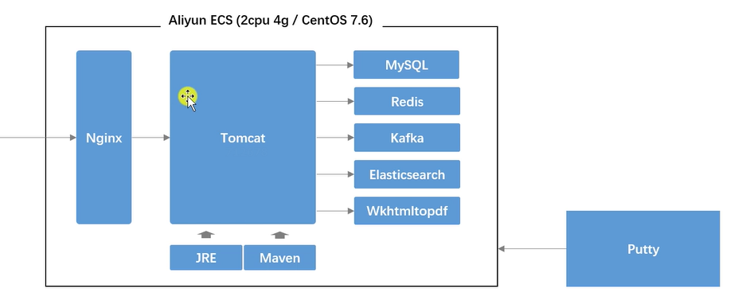
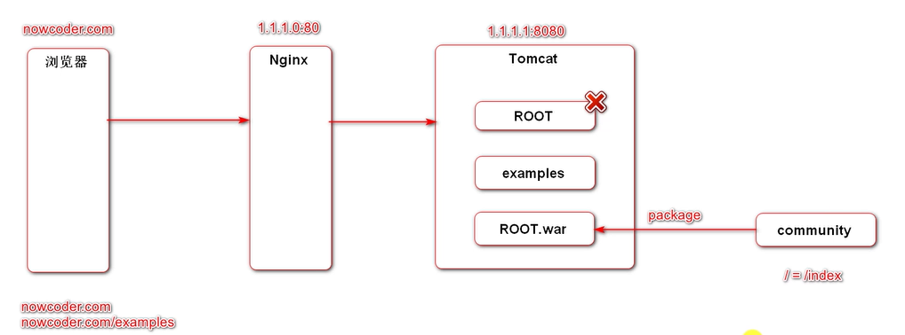
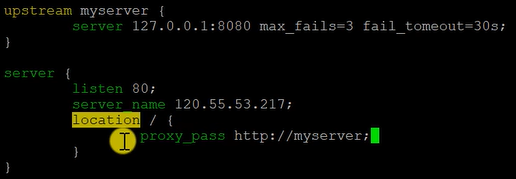

# 部署Linux服务器

**使用Termius**



**反向代理访问tomcat默认流程(访问ROOT)**

\_ MsPG0-s17B.PNG)

**删除tomcat中ROOT把community打包命名为ROOT**



# 常用命令

## 1.下载项目所需的资源包

```java
// Maven.tar.gz
wget -i -c https://dlcdn.apache.org/maven/maven-3/3.8.5/binaries/apache-maven-3.8.5-bin.tar.gz
// apache-tomcat-9.0.63.tar.gz
wget -i -c https://dlcdn.apache.org/tomcat/tomcat-9/v9.0.63/bin/apache-tomcat-9.0.63.tar.gz
// mysql-community-release-exx-x.noarch.rpm
wget -i -c https://dev.mysql.com/get/mysql80-community-release-el8-4.noarch.rpm
// kafka_2.12-2.3.0.tgz(可选RabbitMQ)
wget -i -c https://archive.apache.org/dist/kafka/2.3.0/kafka_2.12-2.3.0.tgz
// elasticsearch.tar.gz
wget -i -c https://artifacts.elastic.co/downloads/elasticsearch/elasticsearch-8.2.0-linux-x86_64.tar.gz
// elasticsearch中文分词.zip
wget -i -c https://github.com/medcl/elasticsearch-analysis-ik/releases/download/v8.2.0/elasticsearch-analysis-ik-8.2.0.zip
// 下载RabbitMQ依赖环境erlang (el7-->centOS7)
wget https://github.com/rabbitmq/erlang-rpm/releases/download/v23.3.4.11/erlang-23.3.4.11-1.el7.x86_64.rpm
// RabbitMQ下载(需与erlang版本匹配 注意：.rpm后缀)
wget https://github.com/rabbitmq/rabbitmq-server/releases/download/v3.8.30/rabbitmq-server-3.8.30-1.el7.noarch.rpm

```

## 2.从本地传输sql文件到服务器

```java
// pscp DemoNowcoder-0.0.1-SNAPSHOT.jar root@101.33.205.98:/root/DemoCommunity
pscp community-init-sql-1.5.zip root@xxx.xx.xxx.xx:/root/DemoCommunity
```

## 3.安装jdk

```java
// 查找java相关环境
yum list java*
// 安装最新版jdk
yum install -y java-latest-openjdk.x86_64 

```

## 4.解压并配置Maven

```java
// 解压maven放到opt文件
tar -zvxf apache-maven-3.8.5-bin.tar.gz -C /opt
// 配置环境变量
vim /etc/profile
// 输入i进入编辑状态,:wq->保存
export PATH=$PATH:/opt/apache-maven-3.8.5/bin
// 使profile文件生效
source /etc/profile
// 查询PATH路径
echo $PATH
// 配置Maven的aliyun镜像 -->cd maven/conf
vim settings.xml
// 在mirror处配置以下
<mirror>
   <id>alimaven</id>
   <mirrorOf>central</mirrorOf>
   <name>aliyun maven</name>
   <url>http://maven.aliyun.com/nexus/content/repositories/central/</url>
</mirror>
// 查看maven版本
mvn-v
```

## 5.安装并配置Mysql

```java
// yum安装mysql
yum install -y mysql80-community-release-el8-4.noarch.rpm
// 查看mysql相关文件
yum list mysql*
// 下载mysql服务器
yum install - y mysql-community-server.x86_64
// 启动mysql
systemctl start mysqld
// 查看mysql运行状态
systemctl status mysqld
// 查询mysql初始密码
grep 'password' /var/log/mysqld.log
// 输入mysql密码进入
mysql -u root -p
// 修改mysql密码
alter user root@localhost identified by '密码(包含数字大小写字符)'
// 创建mysql数据库名(与项目数据库保持一致)
create database community;
// 导入项目的所需.sql文件
user community
source /DemoCommunity/init_sql/init_schema.sql;
source /DemoCommunity/init_sql/init_data.sql;
source /DemoCommunity/init_sql/tables_mysql_innodb.sql;
// 查看数据库表
show tables;
// 将本地头像改成服务器头像
update user set header_url = 'http://images.now.nowcoder.com/head/666t.png' where header_url like '%localhost&';
// 退出mysql
exit
```

## 6.安装并配置redis

```java
// 查询redis相关文件
yum list redis*
// yum安装redis
yum install -y redis.x86_64
// 运行redis
systemctl start redis
// 查看redis运行状态
systemctl status redis
// 进入redis
redis-cli
// 退出redis
exit

```

## 7.1解压并配置Kakfa（有问题！可选用RabbitMQ）

```java
// 解压kafka放到opt下
tar -zvxf kafka_2.12-2.3.0.tgz -C /opt
// 后台启动zookeeper
bin/zookeeper-server-start.sh -daemon config/zookeeper.properties
// 后台启动kafka
nohup bin/kafka-server-start.sh  config/server.properties 1>/dev/null 2>&1 &
// 查看Kafka主题判断是否运行
bin/kafka-topics.sh --list --bootstrap-server localhost:9092

```

## 7.2解压并配置RabbitMQ及erlang

```java
// 安装erlang
rpm -ivh erlang-23.3.4.11-1.el7.x86_64.rpm
// 查看erlang版本
erl -v 
// 安装RabbitMQ依赖包socat
yum install socat -y
// 安装RabbitMQ
rpm -ivh rabbitmq-server-3.8.30-1.el7.noarch.rpm
// 启动服务
systemctl start rabbitmq-server
// 查看服务状态
systemctl status rabbitmq-server
// 开机自启动
systemctl enable rabbitmq-server
// 停止服务(可选)
systemctl stop rabbitmq-server
// 安装RabbitMQ的web端客户端插件
rabbitmq-plugins enable rabbitmq_management
// 重启服务
systemctl restart rabbitmq-server
// 注意：云服务器访问 http://42.192.149.71:15672，需在安全组或防火墙中开放端口号
// 且默认情况下默认账号密码(guest)登录只能在 localhost 本机下访问，所以需要添加一个远程登录的用户
// 创建账号和密码
rabbitmqctl add_user admin 123456
// 设置用户角色
rabbitmqctl set_user_tags admin administrator
// 为用户添加资源权限,添加配置、写、读权限
// set_permissions [-p <vhostpath>] <user> <conf> <write> <read>
rabbitmqctl set_permissions -p "/" admin ".*" ". *" ".*"
```

## 8.解压并配置Elasticsearch

```java
// 解压Elasticsearch到opt下
tar -zvxf elasticsearch-8.2.2-linux-x86_64.tar.gz -C /opt
// 解压中文分词插件到ik目录下
unzip -d /opt/elasticsearch-8.2.2/plugins/ik elasticsearch-analysis-ik-8.2.0.zip 
// 修改/config/elasticsearch.yml文件，修改集群名，数据及日志放置的位置
vim elasticsearch.yml---(path.data: /tmp/elastic/data;path.logs: /tmp/elastic/logs)
// 修改jvm运行时内存
vim jvm.options----(-Xms256m -Xmx512m)
// 更改权限启动elasticsearch(注意：elasticsearch不能由root用户启动)
groupadd nowcoder
useradd nowcoder1 -p 123456 -g nowcoder
// 授予nowcoder1访问opt权限 cd /opt/
chown -R nowcoder1:nowcoder *
// 授予nowcoder1访问tmp权限 cd /tmp/
chown -R nowcoder1:nowcoder* 
// 切换用户
su - nowcoder1
// 进入/opt/elasticsearch/bin下启动elasticsearch
./elasticsearch -d
// 检查elasticsearch是否生效
curl -X GET "localhost:9200/_cat/health?v"

```

## 9.安装并配置wkhtmltopdf

```java
// yum搜索wkhtmltopdf
yum list wkhtmltopdf*
// yum下载wkhtmltopdf
yum install -y wkhtmltopdf.x86_64
// 搜索GUI支持wkhtmltopdf
yum list *xvfb*
// 下载GUI
yum install -y xorg-x11-server-Xvfb.x86_64
// 封装wkhtmltopdf运行脚本 cd /opt
vim wkhtmltoimage.sh
xvfb-run --server-args="-screen 0, 1024x768x24" wkhtmltoimage "$@"
// 授予权限
chmod +x wkhtmltoimage.sh

```

## 10解压并配置tomcat（需添加安全组规则）

```java
// 解压到opt
tar -zvxf apache-tomcat-9.0.63.tar.gz -C /opt
// 配置环境变量
vim /etc/profile
export PATH=$PATH:/opt/apache-tomcat-9.0.63/bin
// 使环境变量生效
source /etc/profile
// 启动tomcat cd /tomcat/bin下
startup.sh

```

## 11.安装并配置nginx

```java
// yum搜索nginx
yum list nginx*
// yum下载nginx
yum install -y nginx.x86_64
// 编辑nginx.conf
vim /etc/nginx/nginx.conf  -->编辑内容如下图
// 启动nginx
systemctl start nginx
// 查看nginx状态
systemctl status nginx

```



## 12.编写yml生产环境和开发环境

**注意：****修改****application-dev.yml****和****application-prod.yml** **(及****logback-spring-dev.xml****和logback-spring-prod.xml** **)相应的路径问题，配置application.yml**

```yaml
#profile
spring:
  profiles:
    active: prod
#logback
logging:
  config:
    classpath: logback-spring-${spring.profiles.active}.xml


```

## 13.将项目配置成war包打包方式

```xml
    <name>DemoNowcoder</name>
    <description>DemoNowcoder</description>
    <packaging>war</packaging>
```

## 14.部署项目

```kotlin
// 将项目打包成zip包上传到服务器(cmd)
pscp community.zip root@xxx.xx.xx.xxx:/root
// 解压zip
unzip -d /root DemoNowcoder.zip
// maven打包成war包（cd到项目所在文件）--忽略测试类
mvn clean package -Dmaven.test.skip=true
// 将target中的ROOT.war包移动到tomcat的webapps下
mv ROOT.war /opt/apache-tomcat-9.0.22/webapps/
// 启动tomcat
startup.sh
// 到tomacat的logs目录下查看启动情况
vim catalina.xxxx-xx-xx.log
```

## 其它方法部署项目（不用安装配置maven和tomcat）

### 1. 在pom文件中开头声明\<packaging>jar\</packaging>

### 2. 第二步，打包，成功后在target中会出现对应的jar包(如果已经有target目录最好先clean一下)


### 3. 第三步，将该jar包上传至你的linux服务器对应的位置

### 4. 第四步，运行(后台运行，即使关闭控制台仍能够运行，并输出日志在同目录下的log.txt)

```java
//nohup java -jar xxxx.jar >log.txt &
nohup java -jar DemoNowcoder-0.0.1-SNAPSHOT.jar >log.txt &

```

### 5. 第五步，查看日志，通过tail -f log.txt查看日志，若显示成功则出现如同在IDE运行时出现的提示消息

```java
tail -f log.txt
```

## Linux通用命令：

### 1.查看端口号

```java
lsof -i:端口号
netstat -tunlp | grep 端口号

```

### 2.杀死进程

```java
kill -9 PID
```
